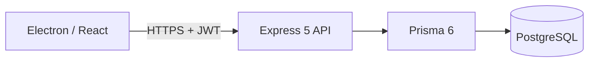
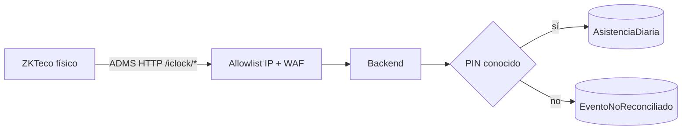
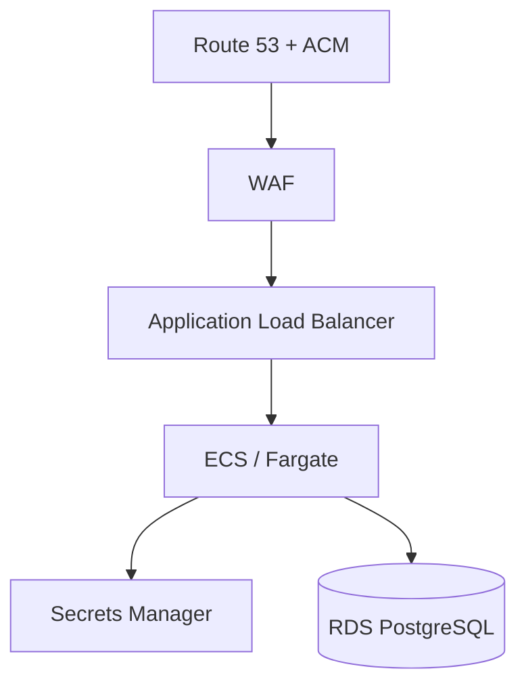

# Arquitectura técnica

## Vista general



Electron mantiene `contextIsolation=true`, `sandbox=true` y
`nodeIntegration=false`. El preload expone un puente IPC limitado para
safeStorage/configuración; el renderer no obtiene acceso general a Node o al
filesystem.

## Backend

```text
routes → middlewares → controllers → services → Prisma/PostgreSQL
```

El guard global de mantenimiento se ejecuta antes de rate limiting,
autenticación y routers. Cuando está activo solo permite `GET /health` y
preflight `OPTIONS`; el resto responde `503 MAINTENANCE_MODE`.

Las vistas empresariales de supervisión usan endpoints de solo lectura:

- `/incidencias`: proyección paginada de `EventoNoReconciliado`, disponible
  para Administrador y RH;
- `/auditoria`: proyección paginada y sanitizada de `AuditLog`, disponible solo
  para Administrador;
- `/health`: señal mínima usada por el indicador de conectividad; no expone
  infraestructura ni reemplaza el monitoreo operativo del backend o la base.

## Asistencia biométrica y ADMS



El enrolamiento y la plantilla de huella/rostro viven en el dispositivo. El
backend conserva indicadores de enrolamiento, `numeroChecador`, método y evento
de asistencia; el schema no tiene un campo de plantilla biométrica. La
integración software está probada con protocolo simulado, no con hardware real.

## Sesiones

- JWT humano y JWT Terminal tienen payloads/middlewares distintos.
- La sesión humana con Recordarme y la sesión Terminal se cifran mediante
  `safeStorage` en el proceso principal.
- Configuración no sensible del kiosco puede permanecer en Local Storage; los
  JWT no.
- El logout elimina el estado local, pero los JWT son stateless y no tienen
  revocación server-side antes de expirar.

## AWS



`us-east-1` continúa como producción. `mx-central-1` tiene un stack paralelo
documentado con sufijo `-mx`; el rehearsal local de datos está validado, pero la
migración de datos real y el corte DNS no se han ejecutado. Consultar
[`../infra/AWS_MIGRATION.md`](../infra/AWS_MIGRATION.md).

## Calidad

CI ejecuta backend/frontend con Node 22 y PostgreSQL 16 para integración. Los
E2E de Electron se ejecutan localmente/pre-release porque requieren runtime
gráfico y orquestación completa; no forman parte del workflow CI actual.
